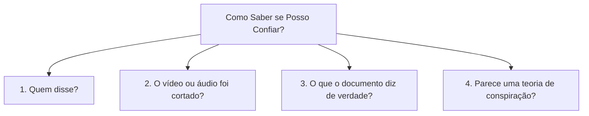

# Portfólio de Pesquisa — Fase Engage

**Projeto:** Copiloto de Verificação de Desinformação em Saúde Pública  
**Grupo 04:** Breno (R1), Wingrid (R2), Vitor (R3 modelagem), Jhessica (R3 avaliação), Samara (R4/R6/R7)  
**Entregável 1 do Challenge (CBL):** Portfólio Consolidado de Pesquisa da Fase Engage  
**Especificações Atendidas:** `pesquisa-investigativa` e `matriz-confianca`  
**Data:** Outubro de 2026  

---

!!! info "Resumo Executivo para Leitura Rápida"
    Na fase inicial deste projeto (fase *Engage*), nossa equipe investigou como as notícias falsas sobre saúde se espalham e por que é tão difícil checá-las no dia a dia. Chegamos a três conclusões fundamentais:
    
    1. **Checar uma notícia dá muito trabalho:** Uma pessoa gasta em média **22 minutos** para investigar a fundo uma mensagem suspeita na internet. O cidadão comum não dispõe desse tempo.
    2. **Dizer apenas «é verdade» ou «é mentira» não resolve:** Se o aplicativo apenas der uma resposta pronta sem explicar o motivo, a pessoa não aprende a reconhecer os sinais de perigo e continuará caindo em outros golpes.
    3. **Criamos uma Matriz de Confiança com sinais práticos observáveis:** Em vez de focar em detalhes técnicos complexos, estruturamos dimensões empíricas para avaliar qualquer mensagem: conferir quem disse (autoridade), se o vídeo/áudio foi cortado (mídia), se distorceram um documento real e se há tom conspiratório.

---

## 1. Contexto e Enunciado do Desafio

O objetivo deste projeto é construir uma ferramenta digital (um copiloto com inteligência artificial) que ajude a população a lidar com a enxurrada de boatos, receitas milagrosas e desinformação sobre saúde pública que circulam em aplicativos de mensagens como o WhatsApp.

Desde o primeiro dia, estabelecemos duas diretrizes obrigatórias:

1. **Recusa ao «veredito sem explicação»:** Aplicativos comuns costumam emitir apenas um selo binário («falso» ou «verdadeiro»). Esse modelo gera dependência e não ensina o cidadão a pensar de forma crítica.
2. **Foco no aprendizado (transferência de conhecimento):** O sucesso do nosso projeto é medido pela capacidade do usuário em aprender o raciocínio da checagem, tornando-se capaz de avaliar a próxima mensagem sozinho, mesmo sem abrir a ferramenta.

---

## 2. Metodologia: O Protocolo de Leitura Lateral

Para que qualquer pesquisador, educador ou cidadão possa reproduzir a nossa investigação, padronizamos um método simples e rigoroso chamado **Leitura Lateral**.

```text
Mensagem suspeita recebida 
   │
   ├──> NÃO CONFIE na aparência, no tom sério ou em logotipos bonitos
   │
   └──> ABRA NOVAS ABAS NO NAVEGADOR (Leitura Lateral)
          ├── 1. Busque o nome do autor / médico em registros oficiais (CRM, Lattes)
          ├── 2. Acesse o site oficial da instituição citada (Ministério da Saúde, Fiocruz, Anvisa)
          ├── 3. Encontre o documento original (bula oficial, artigo científico)
          └── 4. Verifique a data e o contexto da foto ou do vídeo
```

### O que significa Leitura Lateral?
A maioria das pessoas comete o erro de inspecionar apenas a própria mensagem: lê o texto com atenção, repara se o logotipo parece profissional e se o tom de escrita soa convincente. Isso é perigoso, pois golpistas usam linguagem formal e símbolos oficiais falsificados.

Na **leitura lateral**, o avaliador sai da mensagem suspeita e abre novas abas de pesquisa para checar a procedência do conteúdo em fontes independentes e seguras.

### O Passo a Passo Aplicado:
1. **Identificar a afirmação central:** Separar o fato concreto alegado (por exemplo: *"o remédio cura a dengue em 4 horas"*) de palavras emocionais e apelos de compartilhamento (*"urgente", "repasse para todos"*).
2. **Verificar a autoridade citada:** Se a mensagem afirma que *"um médico da UFMG disse"*, a equipe entra em contato com a assessoria da universidade ou busca o nome do médico para saber se a declaração realmente existiu.
3. **Buscar a fonte original:** Localizar o estudo científico, parecer técnico da Anvisa ou bula oficial.
4. **Verificar a data e a integridade da mídia:** Conferir se o vídeo ou foto foi gravado anos atrás ou se trechos importantes foram cortados para inverter o sentido da fala.
5. **Anotar o tempo gasto:** Registrar o tempo do início da busca até a conclusão com prova documental.

---

## 3. Investigação Forense: Os 6 Casos Reais Analisados

Selecionamos **seis casos brasileiros reais de desinformação em saúde**, com foco no tema de **vacinação e tratamentos**, abrangendo diferentes períodos para garantir diversidade. Cada caso foi analisado a fundo por um integrante da equipe, gerando uma ficha técnica individual padronizada.

### Tabela Comparativa dos Casos

| Caso | Afirmação Analisada | Tipo de Manipulação | Tempo Gasto | Fonte Primária Localizada? | Ficha com Detalhes |
| :---: | :--- | :--- | :---: | :---: | :---: |
| **01** | Vacina da febre amarela mata metade das pessoas vacinadas | **Fabricação integral** (autoridade médica anônima inventada) | 10 min | Não existia | [Acessar Ficha do Caso 01](../forense/caso-01-febre-amarela.md) |
| **02** | Suco de inhame corta os sintomas da dengue em apenas 4 horas | **Fabricação integral** (estudo inventado usando o nome da UFMG) | 20 min | Não (UFMG negou oficialmente) | [Acessar Ficha do Caso 02](../forense/caso-02-inhame.md) |
| **03** | Vídeo antigo de 2018 usado para inventar morte pós-vacina | **Recontextualização** (vídeo real com áudio propositalmente cortado) | 20 min | Sim (reportagem de 2018 sobre H1N1) | [Acessar Ficha do Caso 03](../forense/caso-03-video-2018.md) |
| **04** | Texto afirmando que a bula oficial comprova que vacina causa autismo | **Distorção de documento** (leitura errônea de reações adversas) | 24 min | Sim (Bula oficial da fabricante) | [Acessar Ficha do Caso 04](../forense/caso-04-bula-autismo.md) |
| **05** | Entrevista cortada fazendo parecer que presidente da Anvisa atacou vacinas | **Recontextualização por edição** (corte da pergunta da repórter) | 33 min | Sim (Entrevista completa original) | [Acessar Ficha do Caso 05](../forense/caso-05-video-anvisa.md) |
| **06** | Corrente de WhatsApp com suposto relato de médico de Sorocaba | **Fabricação integral** (formato clássico de corrente informal) | 43 min | Não existia | [Acessar Ficha do Caso 06](../forense/caso-06-figado-sorocaba.md) |

### Como classificamos os tipos de manipulação encontrados:
* **Fabricação integral (Casos 01, 02 e 06):** Tudo é inventado do zero (números, declarações ou estudos). Cria-se uma autoridade genérica para convencer o leitor.
* **Recontextualização de mídia antiga ou cortada (Casos 03 e 05):** O vídeo ou foto é verdadeiro, mas a data foi alterada ou o vídeo foi picotado para que a pessoa pareça dizer o oposto do que disse.
* **Distorção de documento real (Caso 04):** O documento citado existe de fato (como uma bula de remédio), mas quem escreveu a mensagem pegou uma frase fora de contexto e inventou uma conclusão médica falsa.

!!! note "Nota de rigor científico: lacunas de cobertura registradas"
    A equipe registrou que manipulações puramente sintéticas (geradas por inteligência artificial / deepfake) e manipulações estatísticas complexas não apareceram nesta amostra de vacinas não-covid, ficando documentadas como lacunas da amostragem inicial. A cobertura de tipos satisfaz o mínimo de três exigido pela spec `pesquisa-investigativa`, mas sem margem: qualquer reclassificação a menos acionaria o cenário de cobertura insuficiente.

---

## 4. O Custo Cognitivo: Por Que o Cidadão Precisa de Ajuda?

Durante a análise dos seis casos acima, cronometramos cada minuto gasto entre abrir a mensagem e encontrar a prova documental:

| Medida | Valor |
| --- | ---: |
| **Mínimo** | **10 min** (Caso 01, febre amarela) |
| **Mediana** | **22 min** |
| **Máximo** | **43 min** (Caso 06, fígado Sorocaba — exigiu rastrear a cadeia de encaminhamentos da corrente) |

### O que esse número prova?
Uma pessoa gasta apenas alguns segundos lendo uma mensagem no celular. Exigir que ela dedique 22 minutos pesquisando na internet para cada mensagem que recebe da família é algo inviável.

É exatamente esse abismo de tempo que faz a desinformação vencer: **decidir acreditar custa 3 segundos; verificar com rigor custa de 10 a 43 minutos.** Por isso, o papel da inteligência artificial deve ser **fazer o trabalho pesado de busca em segundos**, entregando o resultado de forma resumida, simples e comprovada — sem eliminar o raciocínio do usuário.

---

## 5. Pacote de Bases de Dados (Datasets) Utilizados

Para ensinar o sistema de computador e testar o copiloto, organizamos e tratamos diferentes coleções de dados, cada uma com uma finalidade clara:

| Base de Dados | Volume de Mensagens | Para Que Serve no Projeto? | O Que Descobrimos ao Analisar? |
| :--- | :---: | :--- | :--- |
| **FactCenter (Saúde)** | 4.063 checagens | Base de conhecimento e busca de provas oficiais em português | É o coração da busca de respostas do nosso copiloto. Padronizamos os textos para leitura do modelo. |
| **HealthStory / FakeHealth** | ~1.600 reportagens | Comparação entre estudos científicos e manchetes de jornal | Mostra exemplos de como a imprensa às vezes exagera os resultados de pesquisas médicas. |
| **WhaVax e FakeRecogna** | 1.250 mensagens reais de redes | Banco de testes com voluntários humanos | Casos reais de WhatsApp. Desses, 84 casos onde até os médicos tinham opiniões divididas foram separados como casos difíceis de teste. |
| **FACTCK.BR** | 1.313 alegações | Estudo histórico de circulação | Detectamos um erro antigo no arquivo original da internet com caracteres corrompidos, que nossa equipe documentou e corrigiu no código. |

---

## 6. A Matriz de Confiança (Versão 1)

O principal resultado prático da fase Engage é a **Matriz de Confiança**. Reunimos a equipe em oficina presencial e transformamos os erros encontrados nos boatos em **quatro dimensões observáveis**:



### As 4 Dimensões Práticas:

!!! warning "Nota sobre a dimensão Conspiração"
    A dimensão **Enquadramento Conspiratório** é observada nos casos 01 e 06, mas está registrada como **vaga pendente de validação** na versão 1 da matriz. Ela se confunde facilmente com crítica legítima a instituições, e o limite da dimensão ainda não está declarado com precisão suficiente. A decisão final sobre sua inclusão depende do bloco 4 do change `add-engage-desinformacao-saude` e está vinculada à task 8.1 de consistência com o catálogo do MVP.

1. **Falsa Autoridade ou Fonte Inexistente:**
   * *O que observar:* A mensagem cita *"médico conceituado"*, *"diretor de hospital"* ou cita uma universidade famosa sem dar o nome ou sem apresentar link oficial?
   * *O que a IA ajuda a fazer:* Procura se essa pessoa ou estudo realmente existe nas bases oficiais.
   * *Limite da dimensão:* Especialista real com nome pode emitir opinião errada; ausência de nome não implica falsidade em todos os casos.

2. **Recontextualização ou Edição de Mídia:**
   * *O que observar:* O vídeo tem cortes bruscos? O assunto falado combina com a data em que o fato aconteceu?
   * *O que a IA ajuda a fazer:* Encontra a data original da gravação e a fala completa.
   * *Limite da dimensão:* Vídeo íntegro e datado pode ainda assim conter afirmação falsa — a integridade da mídia não garante a veracidade do conteúdo.

3. **Distorção de Documento Real:**
   * *O que observar:* A mensagem cita uma frase isolada de uma bula ou lei para justificar uma teoria absurda?
   * *O que a IA ajuda a fazer:* Compara a frase da mensagem com o texto integral do documento para ver se houve distorção.
   * *Limite da dimensão:* Ausência de documento citado não é prova de falsidade — existem afirmações verdadeiras sem fonte escrita.

4. **Enquadramento Conspiratório:** *(vaga pendente de validação — ver nota acima)*
   * *O que observar:* A mensagem insinua que governos, laboratórios ou cientistas estão escondendo a cura de todos para ganhar dinheiro?
   * *O que a IA ajuda a fazer:* Identifica padrões típicos de enquadramento conspiratório.
   * *Limite da dimensão:* Crítica legítima a instituições e reguladores também pode usar linguagem de denúncia; o padrão sozinho não é evidência de falsidade.

### Sinais que Decidimos Descartar (e por quê):
* **Falta de link na mensagem:** Não serve para julgar, pois quase todas as mensagens de WhatsApp circulam sem link algum.
* **Tom alarmista ou emocional:** Não serve como indício de falsidade. Uma notícia grave e urgente **verdadeira** também tem tom de alerta. Mais importante: o corpus de circulação mostra que boa parte da desinformação antivacina circula em tom calmo e pseudo-técnico — logo, tom exaltado como sinal de falsidade erraria justamente nos casos mais graves.
* **O assunto ser «saúde»:** Não discrimina nada: mensagens verdadeiras também falam sobre saúde.

---

## 7. Conclusão da Fase Engage e Próximos Passos

Com este portfólio, a fase Engage atinge **100% de conclusão**:

* **O Problema está quantificado:** Confirmamos com medições reais a barreira de tempo enfrentada pelas pessoas (mediana de 22 minutos por verificação rigorosa).
* **O Método está comprovado:** A Leitura Lateral demonstrou ser a única estratégia segura contra manipulações bem elaboradas.
* **Os Dados estão tratados:** Organizamos as bases de checagem em português para alimentar o sistema.
* **A Matriz de Confiança está em construção:** As dimensões empíricas guiarão o funcionamento do assistente de inteligência artificial; a validação final das dimensões (especialmente Conspiração) está na task 8.1.

Este material foi transferido para a fase de testes e desenvolvimento técnico do protótipo (fases *Investigate* e *Act*), servindo de referência para todos os membros do grupo e avaliadores da residência.
